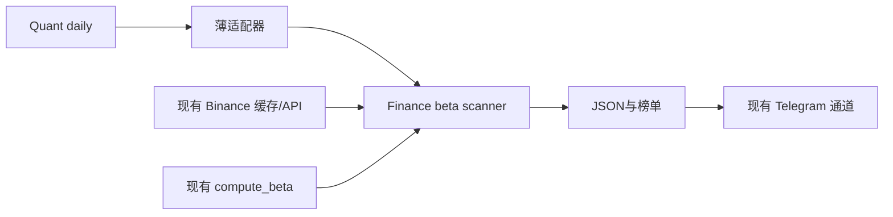
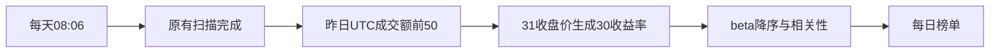

# Crypto BTC Beta 30D Implementation Plan

**Confidence: 95%**
**不确定点**: 无业务口径待决；Boss 已同意前50及30日计算方案。
**Goal:** 在 Quant daily 扫描追加 BTC beta 日榜。
**Tech Stack:** Python、pandas、numpy、现有 Binance scanner。
**北极星对齐**: 第一层量价数据、第二层技术分析；仅描述联动属性，不引入择时信号。北极星该段无需求编号。

## 研究证据
云端 Quant 非 git 仓库，daily_scan_all.py 串行 PMARP/RVOL/NUPL，cron 08:06；Finance 为版本管理来源。PMARP 提供 active USDT perpetual universe、K线转换与缓存读取；旧 get_top_n_symbols 会接受不同日期缓存并退回滚动24h，不能直接复用其排名。Finance compute_beta 可复用，但必须先严格验证连续31个同日收盘价，避免跨缺日收益。

## 架构

## 业务流程

## 替代方案
|方案|优势|劣势|
|--|--|--|
|缓存优先+缺口补取，选前50后计算（采用）|沿用资源、日界一致|必须验证覆盖|
|滚动24h ticker排行|一次请求|不符合已确认完整交易日口径|
|全市场独立采集计算|自包含|重复采集和维护|

## 风险与处理
- 最大风险是过期/缺日混算：固定UTC as_of，排名缺任何活跃合约成交额则不发布完整榜单；上市不足31天显示数据不足，不补排名外资产。
- 使用现有API与beta内核已经是较简单做法；新增严格时间守卫必要。
- API串行，每次补取间隔1秒。排名只补缺失日，历史仅前50+BTC；不写共享行情缓存。
- dry-run禁发消息；正式运行复用Quant Telegram，发送失败抛异常给cron。
- 回滚：备份daily入口，移除新SCANNERS条目即可。生产接线前比较入口哈希并持有现有cron锁。

## 文件与执行清单
- [x] scripts/crypto_beta_scanner.py：严格日线验证、排名、复用beta、相关系数、JSON和消息、dry-run。
- [x] scripts/quant/binance_beta_scanner.py：Quant到Finance薄适配器。
- [x] scripts/quant/daily_scan_all.py：保存现有入口并追加一项。
- [x] tests/test_crypto_beta_scanner.py：合成beta=2/-1/1、缺日/陈旧/重复/坏值、新币、排名、失败语义、无发送预览。
- [x] 定向pytest和Python3.10编译；云端真实dry-run；独立numpy回归对拍。
- [x] 主线程review已完成；已部署入口及模块，验证原有cron、模块导入及哈希。

## 验收
- [x] 前50排名来自同一完整UTC日的USDT成交额。
- [x] 所有有效beta恰好30个收益率；BTC=1；相关性范围[-1,1]。
- [x] 缺口明确，不用0或1冒充结果；基准无效则整榜失败。
- [x] 50行榜单分块不超过Telegram限制，dry-run不发消息。
- [x] 每日入口新增一项、原三项及定时不变。
