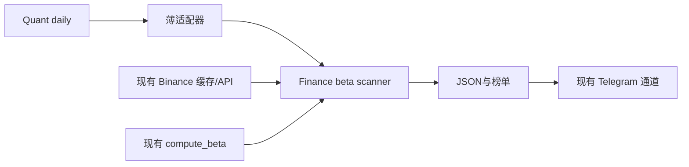
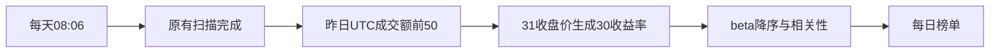

# Crypto BTC Beta 30D Implementation Plan

**Confidence: 95%**
**不确定点**: 无业务口径待决；Boss 已同意前50及30日计算方案。
**Goal:** 在 Quant daily 扫描追加 BTC beta 日榜。
**Tech Stack:** Python、pandas、numpy、现有 Binance scanner。
**北极星对齐**: 第一层量价数据、第二层技术分析；仅描述联动属性，不引入择时信号。北极星该段无需求编号。

## 研究证据
云端 Quant 非 git 仓库，daily_scan_all.py 串行 PMARP/RVOL/NUPL，cron 08:06；Finance 为版本管理来源。PMARP 提供 active USDT perpetual universe、K线转换与缓存读取；旧 get_top_n_symbols 会接受不同日期缓存并退回滚动24h，不能直接复用其排名。Finance compute_beta 可复用，但必须先严格验证连续31个同日收盘价，避免跨缺日收益。

## 架构

## 业务流程

## 替代方案
|方案|优势|劣势|
|--|--|--|
|缓存优先+缺口补取，选前50后计算（采用）|沿用资源、日界一致|必须验证覆盖|
|滚动24h ticker排行|一次请求|不符合已确认完整交易日口径|
|全市场独立采集计算|自包含|重复采集和维护|

## 风险与处理
- 最大风险是过期/缺日混算：固定UTC as_of，排名缺任何活跃合约成交额则不发布完整榜单；上市不足31天显示数据不足，不补排名外资产。
- 使用现有API与beta内核已经是较简单做法；新增严格时间守卫必要。
- API串行，每次补取间隔1秒。排名只补缺失日，历史仅前50+BTC；不写共享行情缓存。
- dry-run禁发消息；正式运行复用Quant Telegram，发送失败抛异常给cron。
- 回滚：备份daily入口，移除新SCANNERS条目即可。生产接线前比较入口哈希并持有现有cron锁。

## 文件与执行清单
- [x] scripts/crypto_beta_scanner.py：严格日线验证、排名、复用beta、相关系数、JSON和消息、dry-run。
- [x] scripts/quant/binance_beta_scanner.py：Quant到Finance薄适配器。
- [x] scripts/quant/daily_scan_all.py：保存现有入口并追加一项。
- [x] tests/test_crypto_beta_scanner.py：合成beta=2/-1/1、缺日/陈旧/重复/坏值、新币、排名、失败语义、无发送预览。
- [x] 定向pytest和Python3.10编译；云端真实dry-run；独立numpy回归对拍。
- [x] 主线程review已完成；已部署入口及模块，验证原有cron、模块导入及哈希。

## 验收
- [x] 前50排名来自同一完整UTC日的USDT成交额。
- [x] 所有有效beta恰好30个收益率；BTC=1；相关性范围[-1,1]。
- [x] 缺口明确，不用0或1冒充结果；基准无效则整榜失败。
- [x] 50行榜单分块不超过Telegram限制，dry-run不发消息。
- [x] 每日入口新增一项、原三项及定时不变。

## Boss追加展示规则（2026-09-07）

仅展示原成交额前50中原始beta严格大于1的有效币种；等于1、小于1和N/A不列出。JSON保留全量计算供审计；无符合者显示明确空榜。沿用现有排序与cron。

## 180×4h vs 30×1d 相对动量对比（Boss确认）

目标：相同30天窗口，比较相对BTC动量排名与近期稳定性。复用原成交额前50快照，标注原beta>1集合；不把固定今日池回放当作历史可交易回测。

- 数据：同源Binance USDT永续，每币串行取4h 224根、1d 39根，支持原始JSON缓存恢复；最多约100请求，每请求间隔1秒。
- 时间：固定原beta快照as_of，排除未收盘线；180个4h收益需要181个收盘价，30个日收益需要31个。
- 评分：均值(r_coin-r_BTC)/样本标准差(r_coin-r_BTC)，不年化；只比较跨频率排名，不直接比较分数值。
- 验证：最近完整日的1d收盘价与六根4h末根收盘价对齐；统一共同有效样本。
- 稳定性：固定池、最近7个完整日端点，各用过去30天窗口；比较相邻日Spearman与Top10留存，属于描述性小样本，非预测有效性证据。
- 风险：行情缺失/新币/零分母显示不可算；全部K线只写研究目录，禁止进入共享缓存；API失败显式报告。
- 方案对比：直接改用4h较快但无法判断差异；同窗双频对比多一次日线请求，能控制时间窗与源差异，采用后者。
- [x] scripts/compare_crypto_relative_momentum.py：采集、验证、排名、报告。
- [x] 合成数据验证时间锚定、分母和缺口处理；云端真数据对拍。
- [x] 交付报告与适用范围，不部署动量指标或改动现有beta口径。

## Daily双榜：beta Top10 + 4h RS Top10（Boss明确要求）

- 范围：共同使用昨日完整UTC日成交额前50。beta沿用30日及严格>1，取前10；4h RS用180个收益率，排除BTC基准，按未年化信息比率降序取前10，不另加正分门槛。
- 复用：`crypto_beta_scanner.scan/MarketData`完成排名和beta；`compare_crypto_relative_momentum.close_series/window/score`完成4h计算。
- 展示：一个Telegram消息开头单列两榜交集，写明两榜排名，指标值见两张榜；两榜条目重复标⭐。交集为0时明确“无”，不暗示缺失数据是未入榜。
- 质量：每榜显示有效覆盖和实际入榜数量；4h基准失败阻止发送完整双榜，单币API失败与历史不足区别记录；Top10不足则真实显示少于10。
- 数据：每次取前50对应4h最多188根候选（涵盖181完整收盘价及当天新增K线），严格按昨日UTC日末截出181根；串行每次1秒，约50次请求。完整原始4h行情按as_of保存独立研究/报告缓存，不能读错日；不写原共享日线缓存。
- 替代：分开发三条消息更易刷屏；采用一条消息：交集→beta前十→RS前十。
- [ ] 编写`crypto_daily_rankings.py`薄编排与双榜渲染；MarketData.fetch增加可选interval。
- [ ] 交集/严格前10/无交集/不足10/4h缺口/发送失败测试。
- [ ] 云端只读真实预览及独立已算4h研究结果对拍。
- [ ] 根据Boss回复确定原PMARP/RVOL/NUPL是否停发，再部署每日入口。
