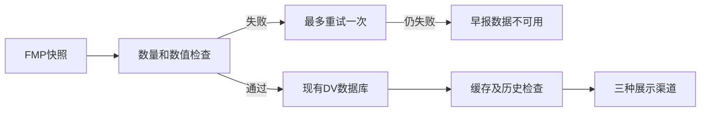
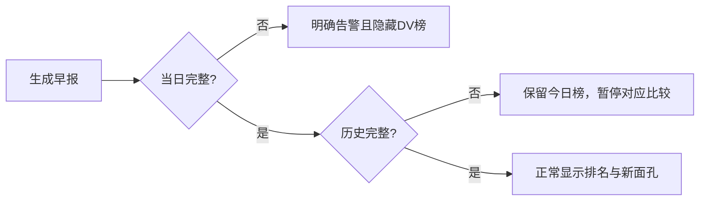

# Dollar Volume 完整性修复 Implementation Plan

**Confidence: 95%**
**授权**：Boss 已明确要求“完整性检查再修一下做好对应措施”，本次按该授权实现和验证；生产数据修复、合并与部署单独交付审批。
**北极星对齐**：north-star.md 第一层数据质量与第二层技术分析输入；沿用 issue062 的全市场 DV 总榜特例，不改变默认 Extended 池。该小修无独立需求编号。
**Goal**：残缺快照不发布、不写入正常历史，不生成假的 NEW/排名变化。
**Tech Stack**：现有 Python / SQLite / 晨报 text、HTML、PNG/PDF。

## 自审修订（2026-09-07）

Boss再次授权“修复”：质量参照独立于昨日排名；最新可信参照可跨失败日，但展示比较不跨。新快照保存完整有效候选集合及参照和快照指纹到quality_evidence表，和排名/日志原子提交。缓存严格验证该证据；旧快照只有作为明确legacy_transition参照的过渡权限，不作为通过新版验证的缓存或历史。历史均不可信时拒绝采集，不静默关闭主要成交股检查。

- [x] 自审P1-1：正常→失败→下一日主要成交股缺失，仍正确拒绝。
- [x] 自审P1-2：缺证据旧缓存不能绕过；有效候选落出Top200不误伤；损坏/指纹变更拒绝。
- [x] 原子提交故障注入、旧writer失效化、云端隔离快照过渡参照检查。
- [x] 扩大调用方回归244 passed/1 skipped，Python3.10 AST与git diff --check通过。

本修订替代下文初版缓存“200条+采集日志即通过”的兼容口径。生产部署仍待批准；历史不会自动补证，30日新面孔需要新证据积累或正式历史验收。

## 研究结论

9/4 08:01 采集 574 只/95 条仍 status=ok，历史通常约 995–1011 只/200 条。collect_daily 只要存在当日行就返回缓存；历史比较不检查质量。issue062 已修 session 日期和渲染过滤，未修本问题。09/07 只读核对：生产 9/4 标签现在是修正过的 200 条，不能重写为旧 95 条。旧日期的交易日错标另属 issue062，本次不自动重新标注历史。

## 架构

## 业务流程

## 方案与风险

|方案|优点|缺点|
|---|---|---|
|仅检查存满200|小改动|漏掉仍能凑满200的部分返回、缓存绕过与历史污染|
|数量基线+结构检查+三入口保护（采用）|覆盖本次故障及相邻失败路径|数量阈值不能证明全市场绝对完整|

固定底线800，叠加最近20个完整成功日扫描量中位数的80%；历史不足时仍应用800。200条需rank连续、symbol唯一、price/volume/DV有限正值、DV降序。新采集还检查上一完整采集日Top20有至少80%在有效量价候选集中（非要求继续留在Top20）。停止用股息和均线冒充当日价格。完整性失败最多重采一次，沿用client串行限速；失败保留原缓存及原日志，新日期无旧快照时写unavailable采集状态（不写排名），使次日无法跳过失败日。坏缓存不原地修历史，展示不可用。最近比较日不合格时排名变化为“—”，不跨过坏日冒充昨日；30日窗口不足或有坏日时暂停新面孔并说明。渲染即使收到 unavailable 携带残留rows也必须隐藏。

最大风险是误报或数量门槛盲区；以当前历史留20%余量，明确不宣称验证所有证券完整性。没有引入替代数据源或无限重试，避免额外API成本。失败异常文本不给用户展示原始API响应或URL。

## 验收与任务

- [x] T1 数据质量函数、历史基线、缓存和历史比较保护；临时SQLite测试。
- [x] T2 collector 两次有界尝试、拒绝写入、去除伪价格；故障注入证明旧数据未被覆盖。
- [x] T3 text/HTML/PNG-PDF 明示不可用和历史不足，隐藏坏榜；三路测试及实际告警HTML/图片/PDF产物。
- [x] T4 Python3.10语法、相关回归、主线程差异检查、issue与runbook；本地commit交付。

验证：相关套件220 passed / 1 skipped。初次渲染回归5项因隔离worktree缺concept注册表而失败；仅从本地只读库复制concepts和company_concept_tags到worktree测试库后全通过，未链接生产可写数据。云端只读SQLite backup至内存，再iterdump到本地隔离快照：9/3与9/4均200条通过，当前门槛804；两日期质量及历史检查共0.219秒。全历史数量扫描发现库标签7/15=119、7/30=99、8/14=89；后两者在最新30日窗口中，故新面孔暂停。云端Python3.10无serialize，诊断导出改用iterdump；不修改运行代码或远程文件。

生产步骤（未授权执行）：部署前备份显式 dollar_volume.db；锁内只读扫描历史质量，坏日期先归档再修复或隔离；不能拿当前screener重放过去交易日。自然cron或隔离数据源验证状态、告警和200条覆盖后验收。代码回滚用revert，数据恢复用一致性备份；本次开发不接入生产库写入。
